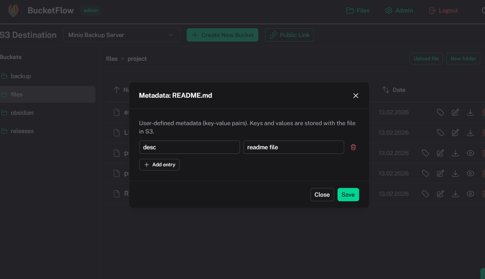

# File Manager Operations

[← Back to index](index.md)

The main file manager appears on the home page after login. Select a destination and bucket to browse files.

## Navigation

- **Destination selector** — Choose which S3 destination to use
- **Bucket sidebar** — List of buckets; click to switch
- **Breadcrumbs** — Navigate through folder hierarchy
- **Grid/List view** — Toggle between grid and list layout

## File Operations (Editors & Admins)

| Operation         | Purpose                                  |
| ----------------- | ---------------------------------------- |
| **Browse**        | Navigate folders and files               |
| **Upload**        | Upload files to storage                  |
| **Download**      | Save file locally                        |
| **Preview**       | View file in browser (images, PDF, text) |
| **Create folder** | Create new folder                        |
| **Rename file**   | Change file name                         |
| **Rename folder** | Change folder name                       |
| **Delete file**   | Remove file                              |
| **Delete folder** | Remove folder                            |
| **Edit metadata** | Set user defined metadata                |

## Bucket Operations (Admin only)

- **Create bucket** — "Create New Bucket" in the header
- **Rename bucket** — Pencil icon next to bucket name in sidebar (copies all objects to new bucket)

## Upload Features

- Drag-and-drop support
- Multi-file upload
- Progress indicator per file
- Presigned URLs (direct upload to S3, no proxy)

## Preview Support

- **Images** — jpg, jpeg, png, gif, webp, svg
- **PDF** — Inline PDF viewer
- **Text files** — txt, md, json, code files, etc.
