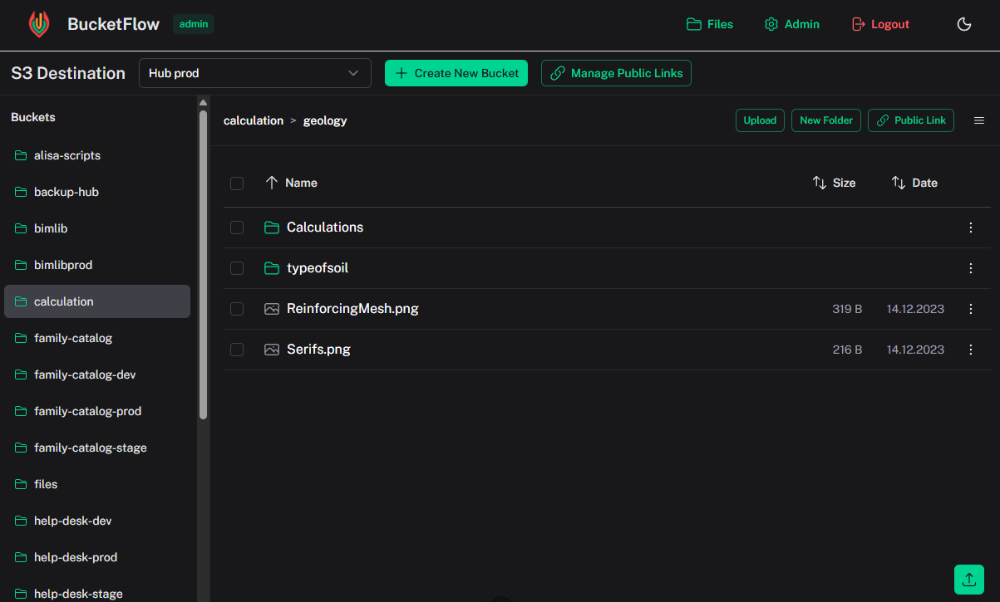
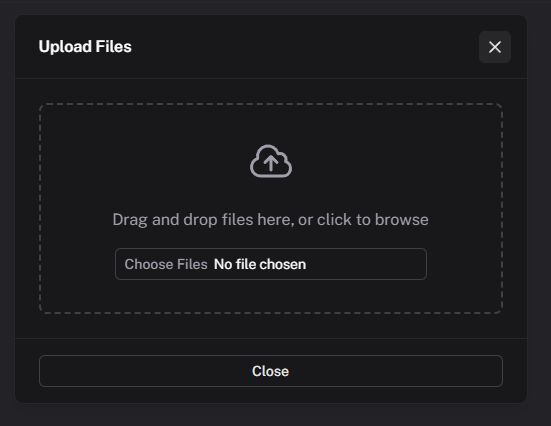
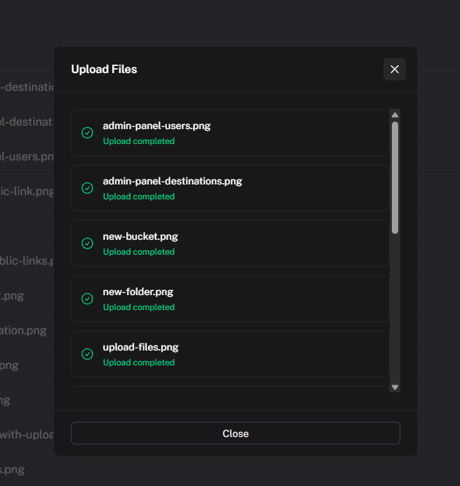
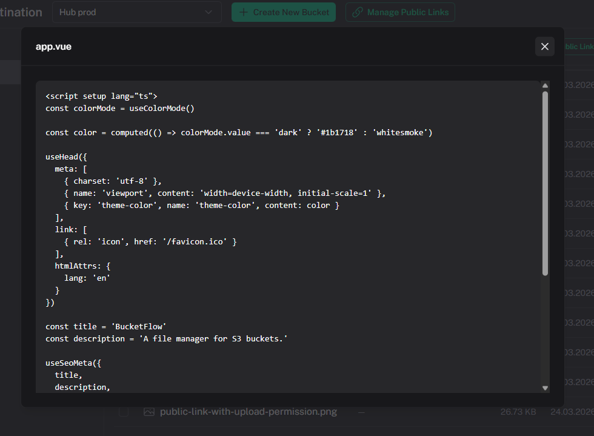
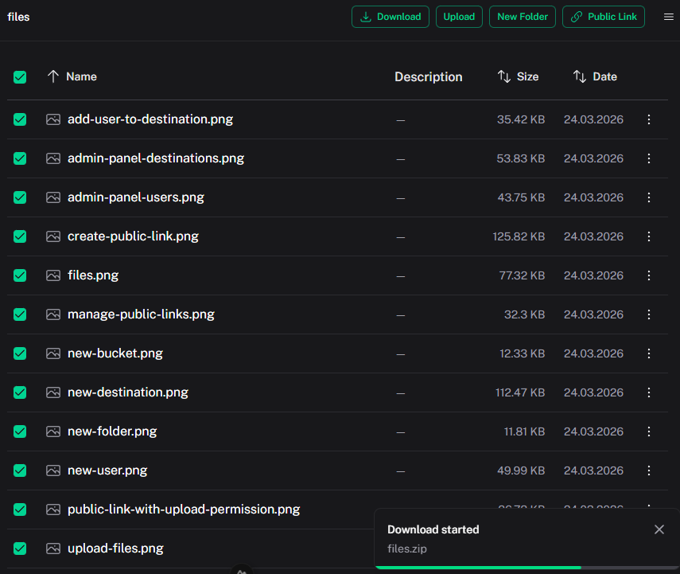
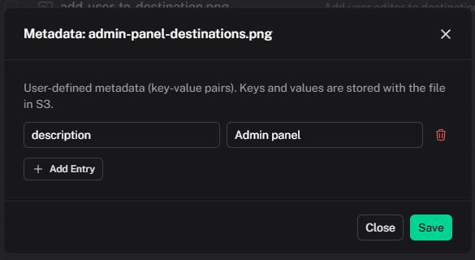
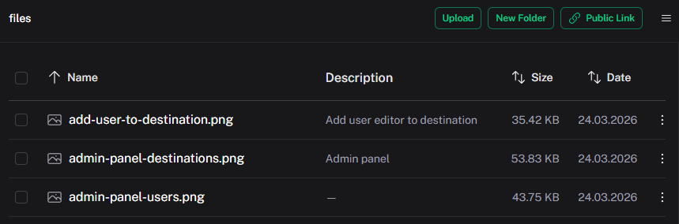
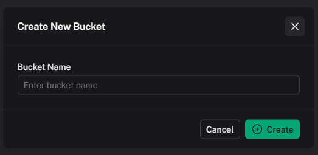
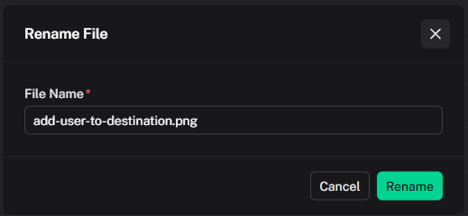

# File Manager

[← Back to index](index.md)

After login, the main file manager is displayed.

## Navigation

- **S3 Destination** — select active destination
- **Bucket sidebar** — switch between buckets
- **Breadcrumbs** — navigate nested folders
- **Grid/List** — toggle layout mode

## Available operations

| Operation | Description |
|----------|-------------|
| Browse | Explore files and folders in current bucket |
| Upload | Upload one or multiple files |
| Download | Download a single file |
| Download selected | Bulk download selected files/folders as ZIP |
| Preview | Preview images, PDF, and text files |
| Create folder | Create a folder |
| Rename file/folder | Rename file or folder |
| Delete file/folder | Delete file or folder |
| Metadata | View/edit S3 object metadata |

## Bulk actions

- Select multiple rows
- Click **Download selected**
- If only one file is selected, it is downloaded directly
- If multiple items/folders are selected, a ZIP archive is generated

## Metadata

If destination **Metadata columns** are configured, those keys appear as table columns.

- View object metadata values
- Edit custom metadata for objects

## Bucket operations (admin only)

- **Create New Bucket** — create bucket
- **Rename bucket** — rename bucket

