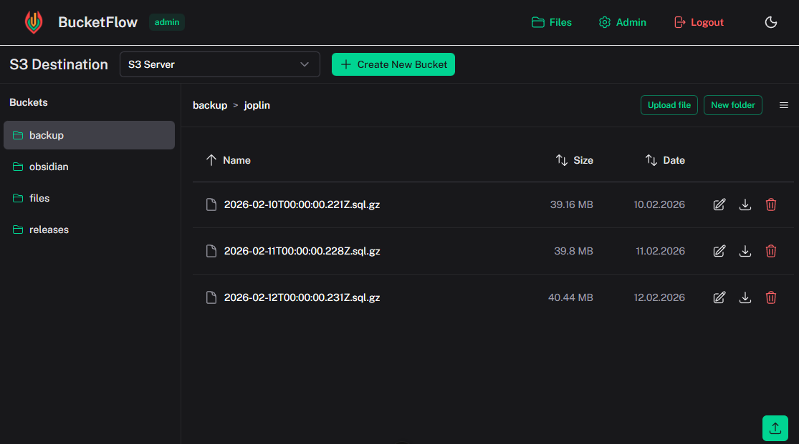

# BucketFlow Documentation

A modern, self-hosted S3-compatible storage file manager built with Nuxt and Nuxt UI. Manage your cloud objects across AWS S3, Cloudflare R2, MinIO, Wasabi, DigitalOcean Spaces, and any S3-compatible service — all from a single, beautiful interface.

---

## Table of Contents

- [Overview](overview.md)
- [User Roles](user-roles.md)
- [S3 Destinations](s3-destinations.md)
- [User Management](user-management.md)
- [File Manager Operations](file-manager.md)
- [Public Sharing](public-sharing.md)
- [Embeddable Viewer](embeddable-viewer.md)
- [Installation](installation.md)
- [Environment Variables](environment-variables.md)
- [Project Structure](project-structure.md)
