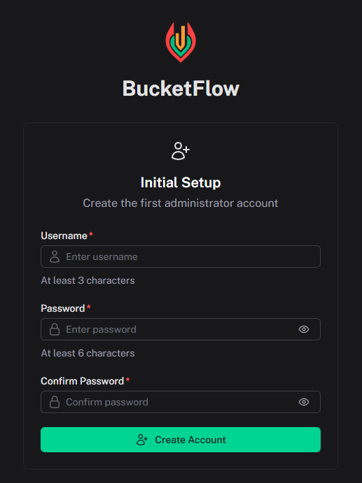
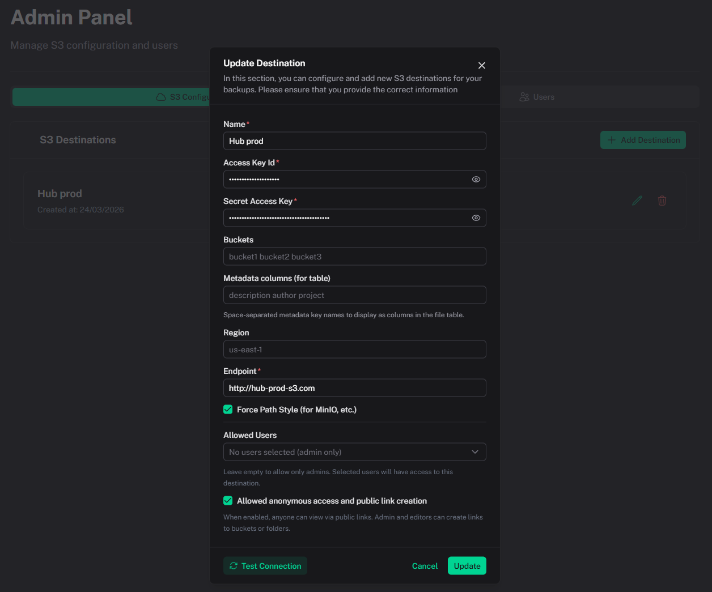

# Installation

[← Back to index](index.md)

## Requirements

| Method | Requirements |
|--------|--------------|
| **Docker** | Docker 20.10+ and Docker Compose v2 |
| **Local** | Node.js 20+, [pnpm](https://pnpm.io) 9+ |

---

## Docker deployment (recommended)

### Option A: run from repository source

```bash
git clone https://github.com/ambyte/bucketflow.git
cd bucketflow
docker compose up -d
```

This option uses the local [Dockerfile](../Dockerfile) and is ideal for development or custom builds.

### Option B: pre-built GHCR image

Create a [docker-compose.yml](../docker-compose.yml) with the following service:

```yaml
services:
  bucketflow:
    image: ghcr.io/ambyte/bucketflow:latest
    container_name: bucketflow
    restart: unless-stopped
    ports:
      - "3000:3000"
    volumes:
      - bucketflow-data:/app/.data/storage
    healthcheck:
      test: ["CMD", "wget", "-q", "-O", "/dev/null", "http://localhost:3000/api/health"]
      interval: 30s
      timeout: 10s
      retries: 3
      start_period: 10s

volumes:
  bucketflow-data:
```

Then run:

```bash
docker compose up -d
```

### Docker setup benefits

- Automatic restart (`restart: unless-stopped`)
- Persistent data storage in `bucketflow-data`
- Health checks on `/api/health`

---

## First launch

1. Open [http://localhost:3000](http://localhost:3000)
2. On first run, create the initial admin account



3. Go to **Admin Panel → S3 Configuration** and add your first destination



Field details are documented in [S3 Destinations](s3-destinations.md).

---

## Local development

```bash
git clone https://github.com/ambyte/bucketflow.git
cd bucketflow
pnpm install
pnpm dev
```

The app will be available at [http://localhost:3000](http://localhost:3000).

Build and preview production locally:

```bash
pnpm build
pnpm preview
```

---

## Troubleshooting

| Issue | Solution |
|-------|----------|
| Port `3000` is already in use | Change port mapping, e.g. `"8080:3000"` |
| Container exits immediately | Check logs: `docker compose logs bucketflow` |
| Data seems missing after restart | Ensure `bucketflow-data` is used and avoid `docker compose down -v` unless intentional |
| Health check fails initially | Wait 10–30 seconds after startup, especially on first boot |
