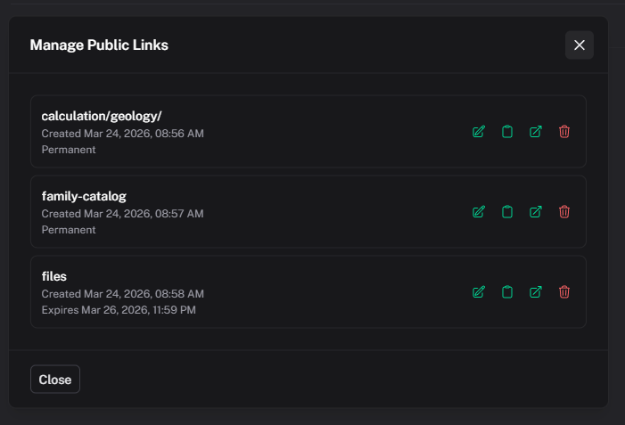
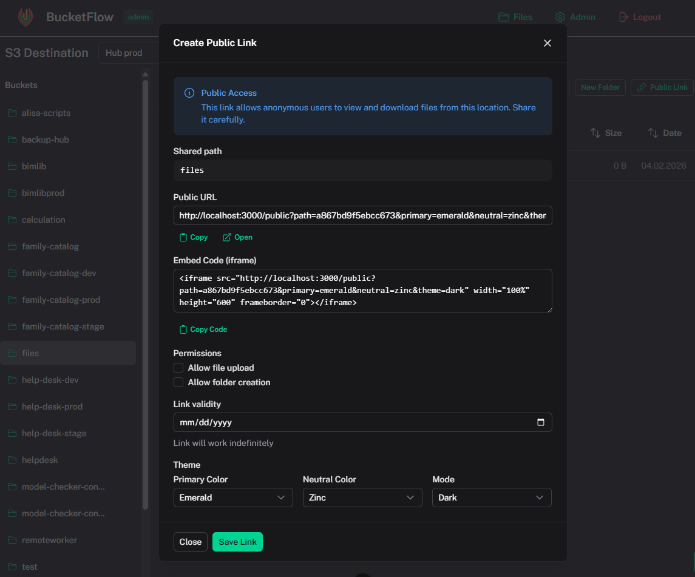
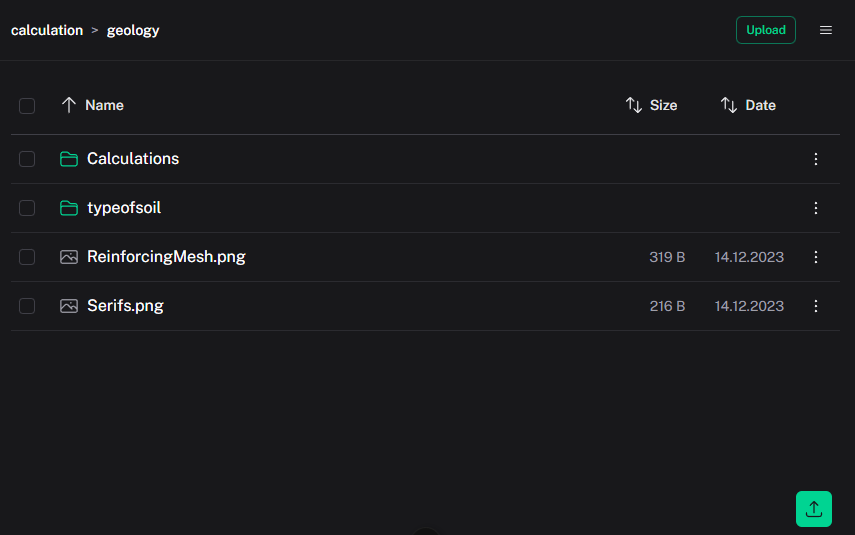

# Public Sharing

[← Back to index](index.md)

Public links are available only for destinations with **Allowed anonymous access** enabled.



## Creating a public link

1. Select a destination with public access enabled
2. Open target bucket/folder
3. Click **Public Link**
4. Copy URL or `iframe` embed code



## Link settings

- target bucket/path;
- expiration date (or permanent link);
- public page theme (`primary`, `neutral`, `theme`);
- permissions:
  - **Allow file upload** — allow file uploads;
  - **Allow folder creation** — allow creating folders.



## Public URL format

```text
https://your-domain.com/public?path=<hash>&primary=emerald&neutral=zinc&theme=light
```

| Parameter | Description |
|----------|-------------|
| `path` | Public link hash (required) |
| `primary` | Primary theme color |
| `neutral` | Neutral palette |
| `theme` | `light` or `dark` |

## Managing existing links

In **Manage Public Links** you can:

- list destination links;
- open the public page;
- copy URL;
- edit settings (including expiration and permissions);
- delete links.

## Security behavior

- access is scoped to link bucket/path;
- admin features are unavailable in public mode;
- default mode is read-only unless upload/folder creation is explicitly enabled.
