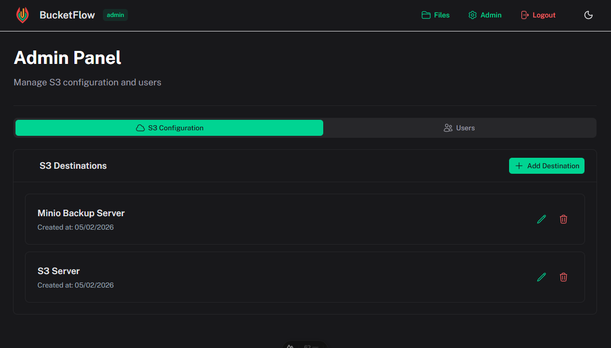
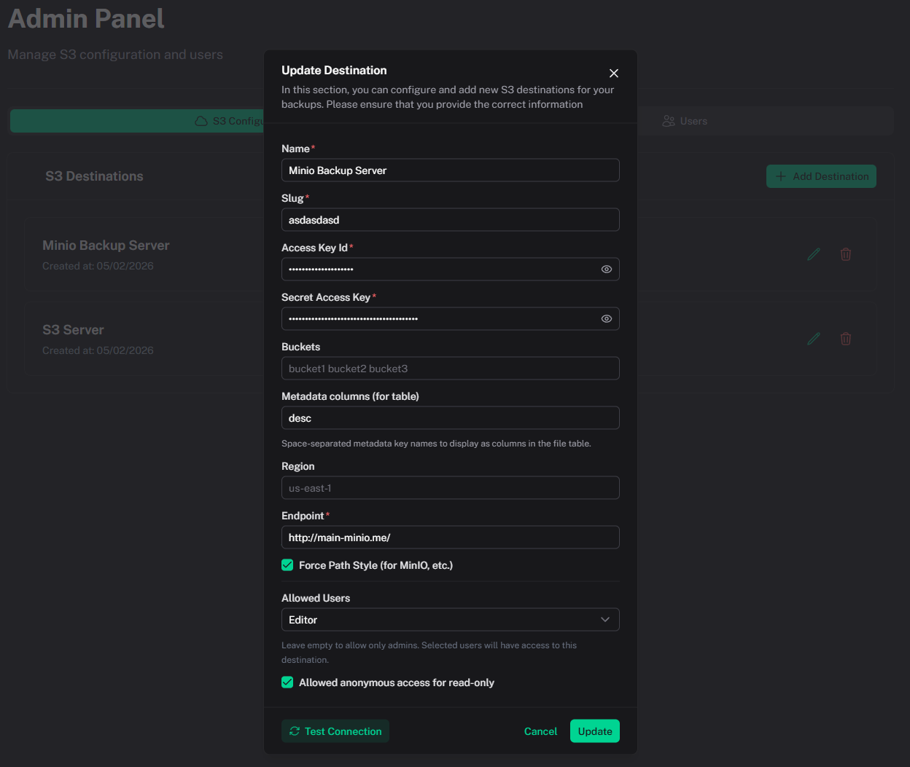

# S3 Destinations

[← Back to index](index.md)

Admins configure S3 destinations in **Admin Panel → S3 Configuration**. Each destination represents a connection to an S3-compatible service.

## Adding a Destination

1. Go to **Admin → S3 Configuration**
2. Click **Add Destination**
3. Fill in the form:

| Field | Description |
|-------|-------------|
| **Name** | Display name for the destination |
| **Slug** | URL-friendly identifier (used in public links, e.g. `my-storage`) |
| **Access Key ID** | S3 access key |
| **Secret Access Key** | S3 secret key |
| **Buckets** | Optional space-separated list to restrict to specific buckets |
| **Metadata columns** | Space-separated metadata key names (e.g. `description author project`) to display as columns in the file table; S3 object metadata will be shown for these keys |
| **Region** | e.g. `us-east-1` |
| **Endpoint** | S3 endpoint URL (e.g. `https://s3.amazonaws.com`) |
| **Force Path Style** | Enable for MinIO and similar providers |
| **Allowed Users** | Select editor users who can access this destination (empty = admin only) |
| **Allowed anonymous access** | Enable public read-only access via shareable link |

## Destination Options

- **Test Connection** — Verify credentials before saving
- **Edit** — Update configuration
- **Delete** — Remove destination (does not delete data in S3)
