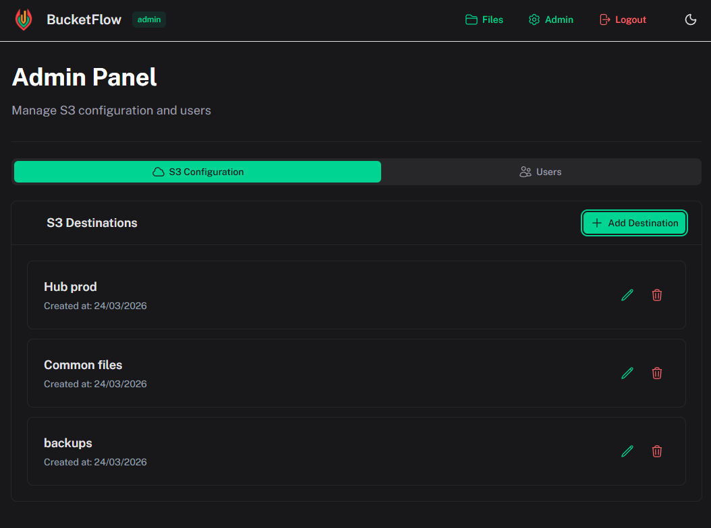

# S3 Destinations

[← Back to index](index.md)

An S3 destination is a connection to a specific S3-compatible provider.

Configuration is available in **Admin Panel → S3 Configuration**.

## Adding a destination

1. Open **Admin Panel → S3 Configuration**
2. Click **Add Destination**
3. Fill in the fields

| Field | Purpose |
|------|---------|
| **Name** | Display name of the destination |
| **Access Key ID** | S3 access key |
| **Secret Access Key** | S3 secret key |
| **Buckets** | Optional space-separated bucket allow-list |
| **Metadata columns** | Space-separated metadata keys displayed as file table columns |
| **Region** | Provider region, e.g. `us-east-1` |
| **Endpoint** | S3 endpoint URL, e.g. `https://s3.amazonaws.com` |
| **Force Path Style** | Enable for MinIO and similar services |
| **Allowed Users** | Editors allowed to access this destination |
| **Allowed anonymous access** | Enables public links and anonymous access |

## Additional actions

- **Test Connection** — validate connectivity before saving
- **Edit** — update destination settings
- **Delete** — remove destination (does not delete data from S3)

## Supported providers

- AWS S3
- Cloudflare R2
- MinIO
- Wasabi
- DigitalOcean Spaces
- Any S3-compatible API
