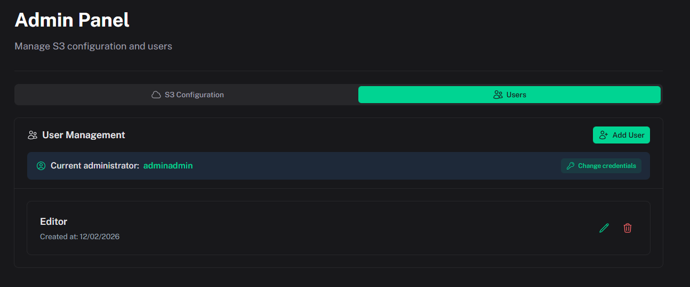
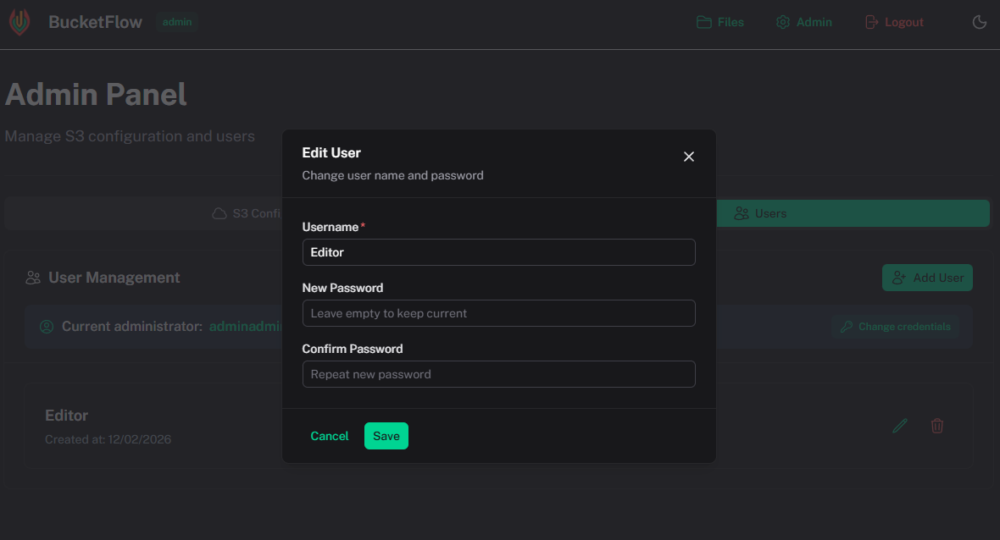

# User Management

[← Back to index](index.md)

Admins manage users in **Admin Panel → Users**. Only **Editor** users can be created via the UI; the admin account is created on first launch.

## Creating an Editor

1. Go to **Admin → Users**
2. Click **Add User**
3. Enter username (min 3 characters) and password (min 6 characters)
4. Click **Create User**

## Managing Users

- **Edit** — Change password
- **Delete** — Remove user (cannot delete yourself)

After creating editors, assign them to destinations in **S3 Configuration → Allowed Users**.
