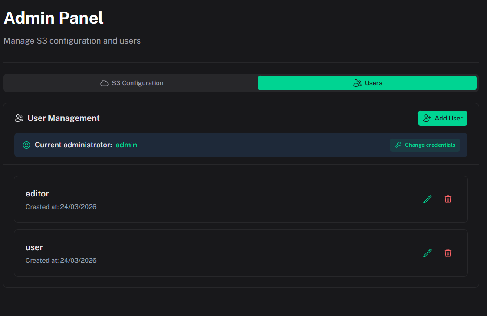
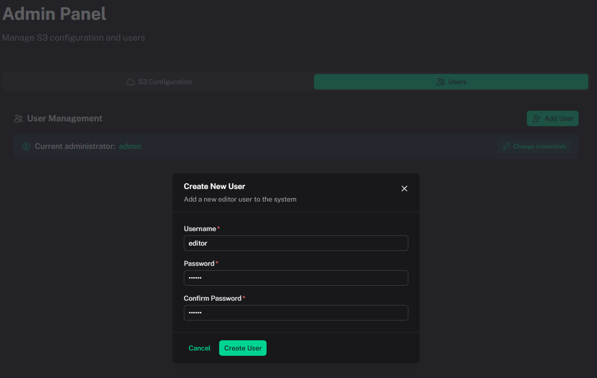
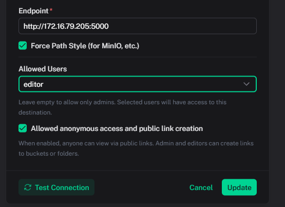

# User Management

[← Back to index](index.md)

This section is available at **Admin Panel → Users**.

Only **Editor** users are created via UI. The first admin account is created on initial setup.

## Creating an editor user

1. Open **Admin Panel → Users**
2. Click **Add User**
3. Enter username (minimum 3 characters)
4. Enter password (minimum 6 characters) and confirmation
5. Click **Create User**

## Editing and deleting users

- **Edit** — update username and/or password
- **Delete** — remove an editor user
- Current admin has a dedicated **Change credentials** flow

After creating editor users, grant destination access in [S3 Destinations](s3-destinations.md) using **Allowed Users**.
